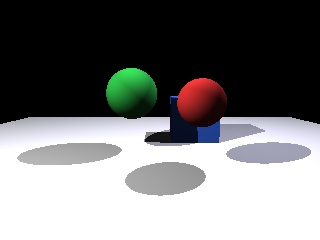

# Ray Tracing Application

This project provides a minimal ray tracer that renders images from 3D scenes described in JSON. The current implementation supports perspective cameras, diffuse materials, point lights, spheres, and axis-aligned cubes. Output images are written in the PPM (P3) format to avoid external dependencies.



## Usage

```bash
python3 raytrace.py scene.json output.ppm
```

- `scene.json`: Path to a JSON file describing the camera, objects, and lights.
- `output.ppm`: Path where the rendered image will be written.

## Scene JSON format

```json
{
  "camera": {
    "position": [0, 0, -5],
    "look_at": [0, 0, 0],
    "up": [0, 1, 0],
    "fov": 60,
    "width": 400,
    "height": 300
  },
  "objects": [
    {
      "type": "sphere",
      "center": [0, 0, 0],
      "radius": 1,
      "color": [1.0, 0.2, 0.2]
    },
    {
      "type": "cube",
      "min": [-2, -1, 3],
      "max": [-1, 1, 4],
      "color": [0.2, 0.2, 1.0]
    }
  ],
  "lights": [
    {
      "type": "point",
      "position": [5, 5, -5],
      "intensity": [1.0, 1.0, 1.0]
    }
  ]
}
```

- Colors and intensities are specified as RGB triples in the range `[0, 1]`.
- Cubes are defined as axis-aligned boxes using `min` and `max` corner coordinates.

## Development notes

- The renderer uses simple Lambertian shading with hard shadows.
- All geometry and maths are implemented with standard Python and do not require third-party libraries.

## Visual Scene Editor

A browser-based editor is available under `editor/index.html` to assemble scenes without hand-editing JSON. Open the file in any modern browser (no build step required) and use the UI to:

- Place spheres and axis-aligned cubes; move them with gizmos and resize them via numeric inputs.
- Add point lights, adjust their position, RGB intensity, and an optional direction vector (stored for future use).
- Configure the render camera (position, look-at target, up vector, FOV, output resolution) and sync it with the current viewport.
- Export the constructed scene directly to JSON or import an existing scene file for further edits.

The exported JSON matches the format accepted by `raytrace.py`, so you can save the file and render it immediately with the existing CLI.
